# NBA_predictions
The goal of this project was to predict the outcome of NBA games using historical NBA data.
Binary classifcaiton tecnhiques, like Linear Regression and KNN, trained on data from over 23,000 NBA games, resulted in an accuracy of .645 and AUC of 0.685

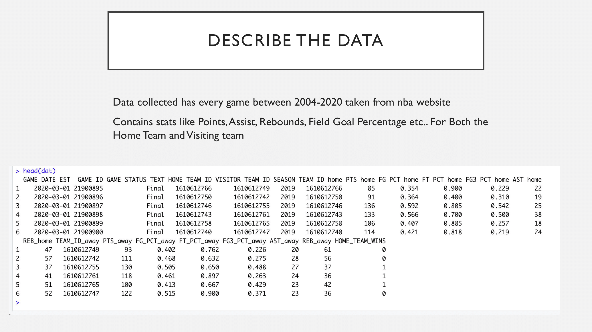
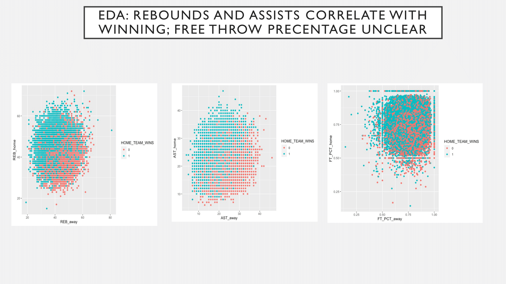
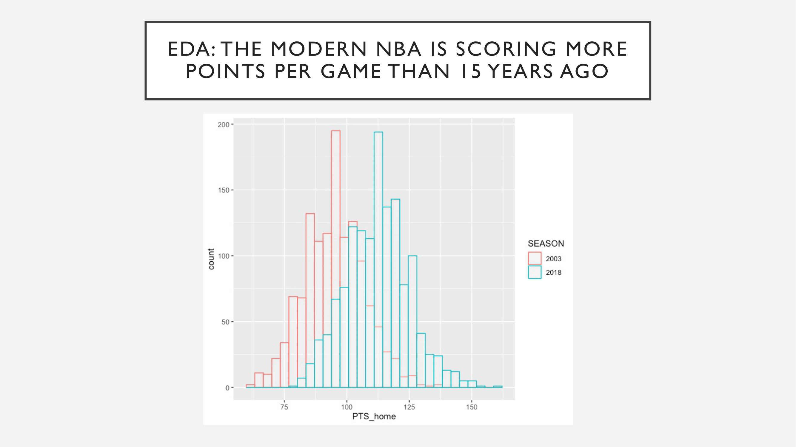
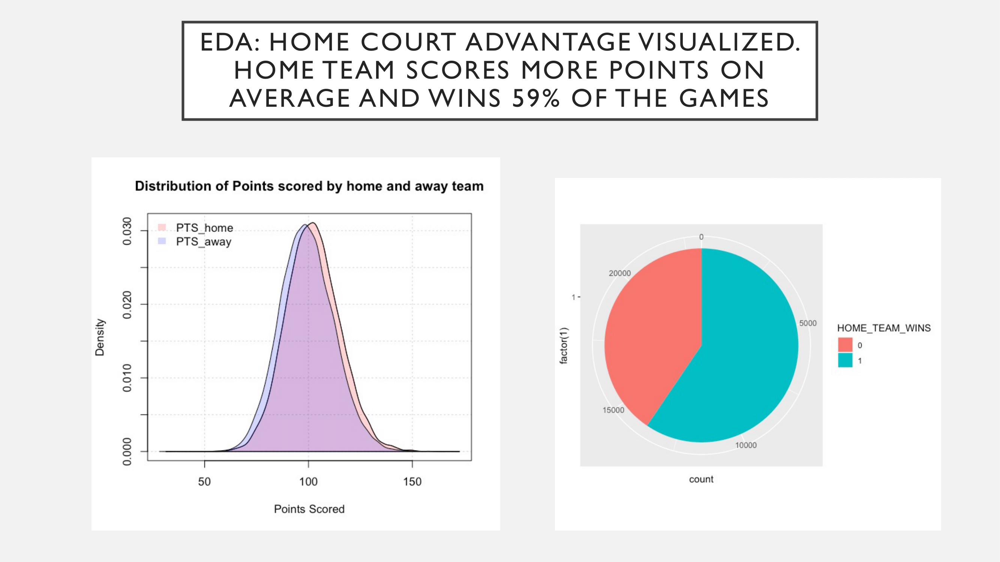
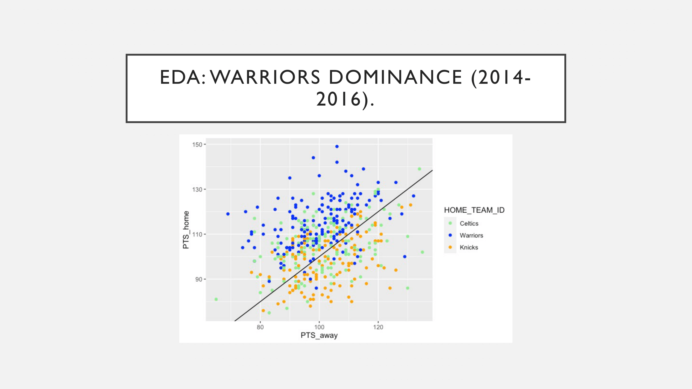
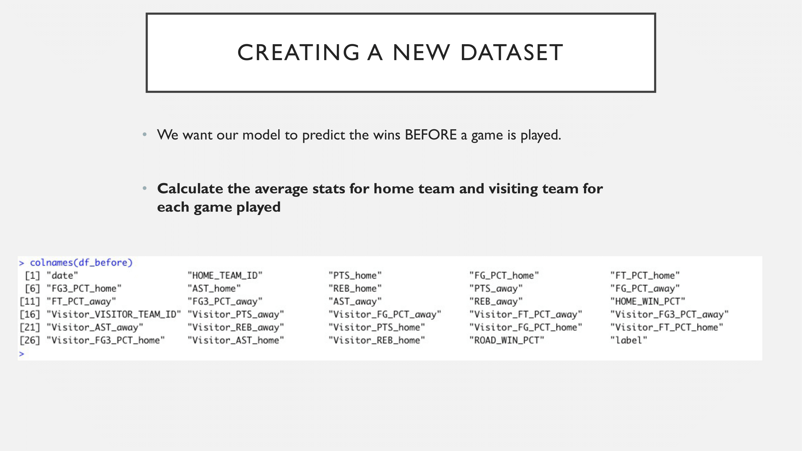
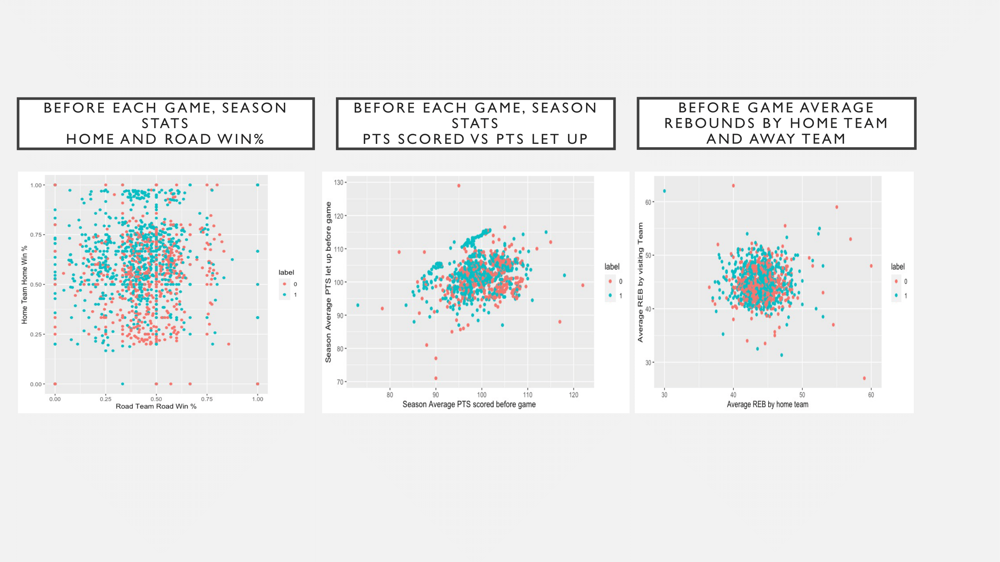
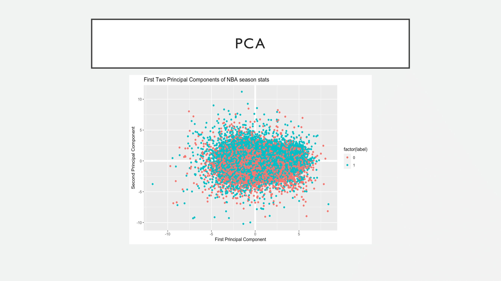
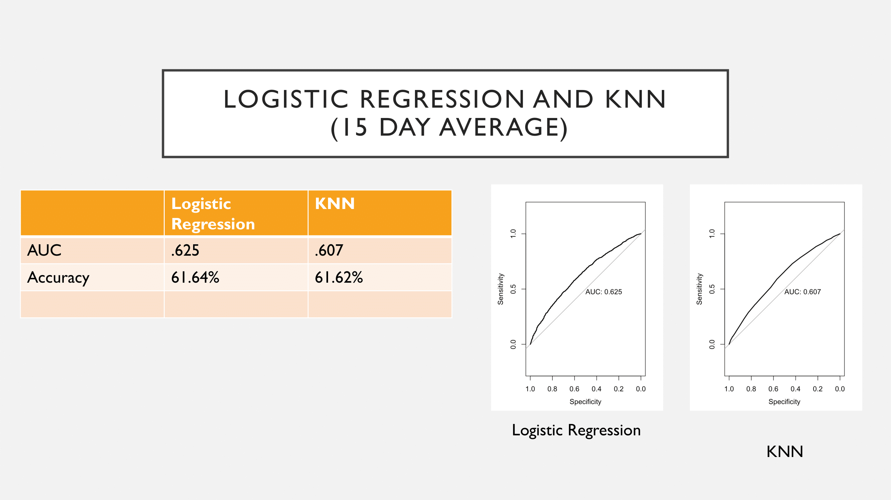
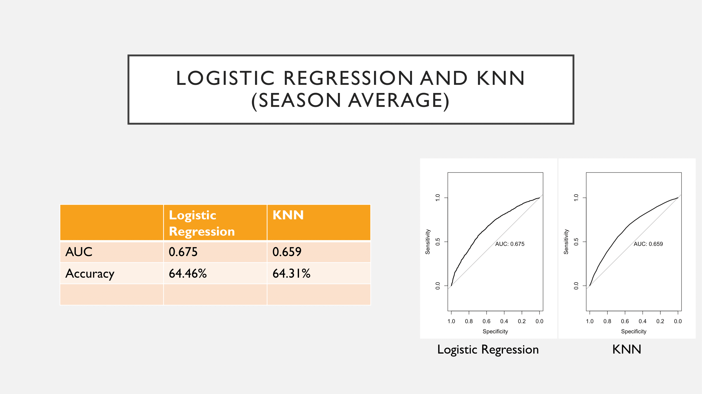
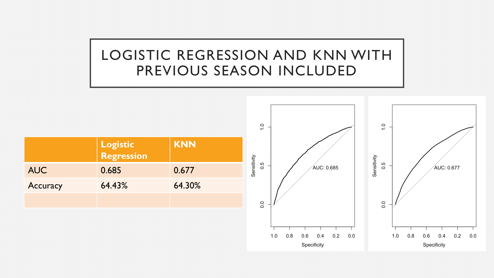
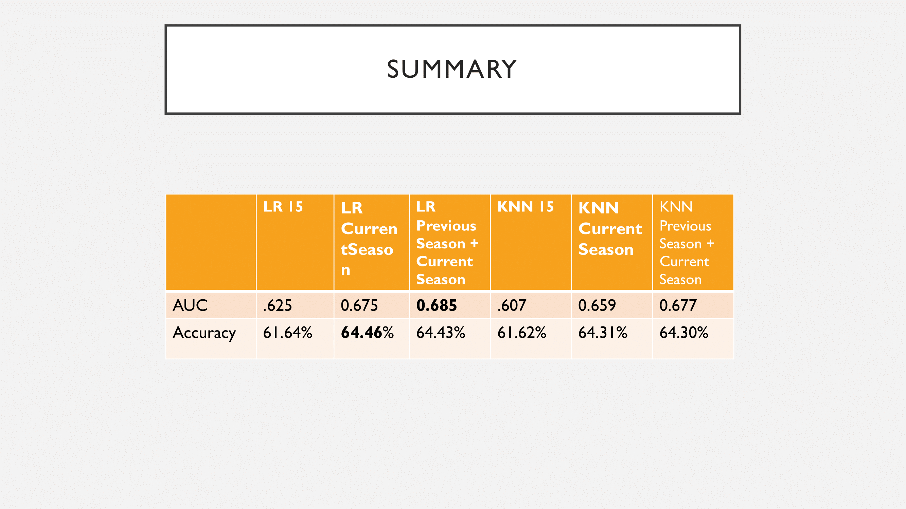
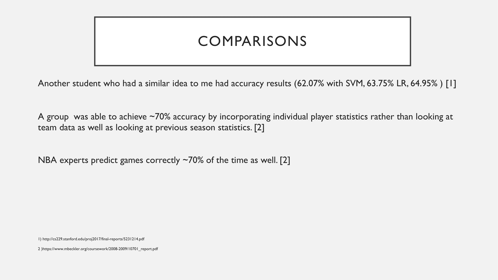
